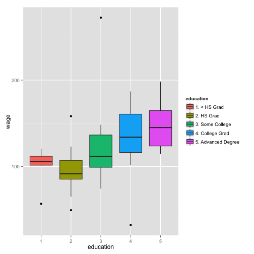

Wage Predictor
========================================================
author: paolo0164
date: July 2015

Application Description
========================================================

The application implements a **wage predictor** based on 
income survey data for 3000 males in Mid-Atlantic region of USA, loaded from ISLR package.

Selecting 8 variables ("Education", "Race", "Age", "Marital Status", "Job Class", "Health", "Health Insurance", "Year") the system will provide a prediction of wage the worker could obtain.

If the combination of variables chosen by user is the same as those in training data, the exact value of wage will be displayed and also the residual (the difference between the observed value and the estimated value).

Trainig and Prediction 1/2
========================================================
The algorithm used to predict wage from Wage ISLR data set is **Linear Regression**. 

*Note: The focus of the project is not on prediction model performance.*
### Training

```r
library(ISLR);
library(caret);
data(Wage)
Wage <- subset(Wage,select=-c(logwage,sex,region))
modFit<- train(wage ~ ., method = "lm",data=Wage)
```

Trainig and Prediction 2/2
========================================================
The Shiny application gets the input data from UI, builds the data.frame and calls "predict"" function. 
Example (simulation):
### Prediction

```r
library(ISLR);
library(caret);
df <- data.frame(year=2003,age=42,maritl="2. Married",race="1. White", education="2. HS Grad",jobclass="1. Industrial",health="2. >=Very Good",health_ins="1. Yes")
wagePred <- predict(modFit, df)
wagePred
```

```
[1] 105.6492
```

Data Exploration
========================================================
A simple data exploration has been implemented in intercatcive mode.
The user can change the Age variable from slidebar and see how the wage is affected changing education level and age.

 
